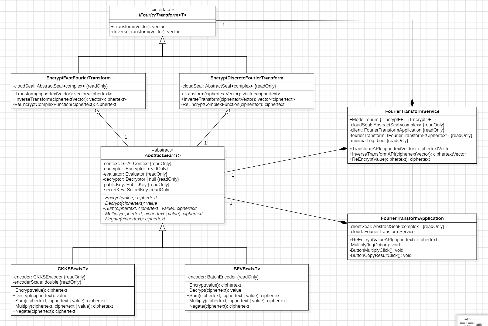
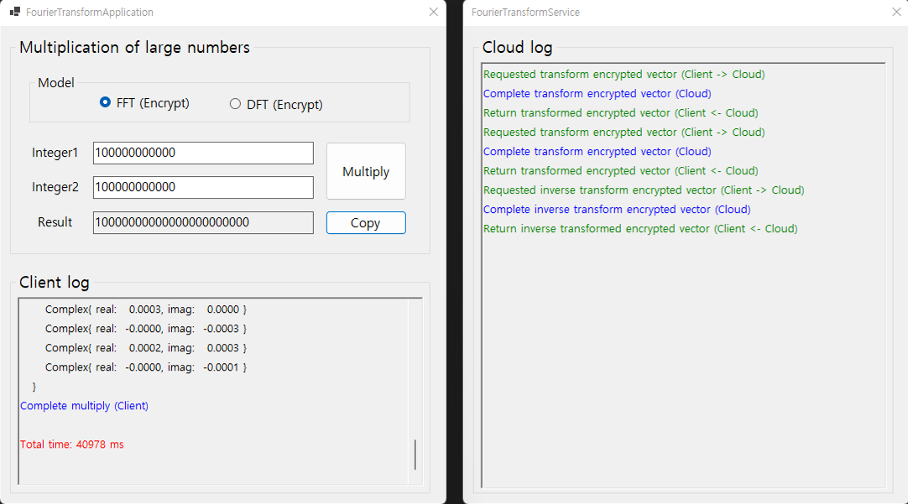
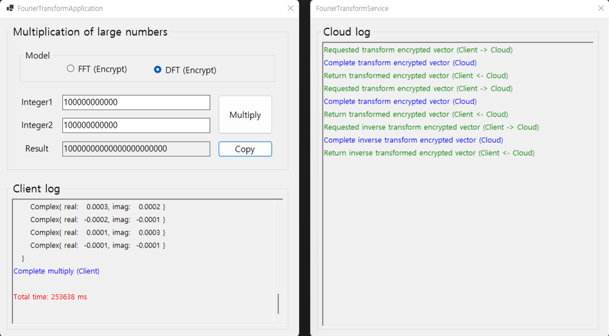
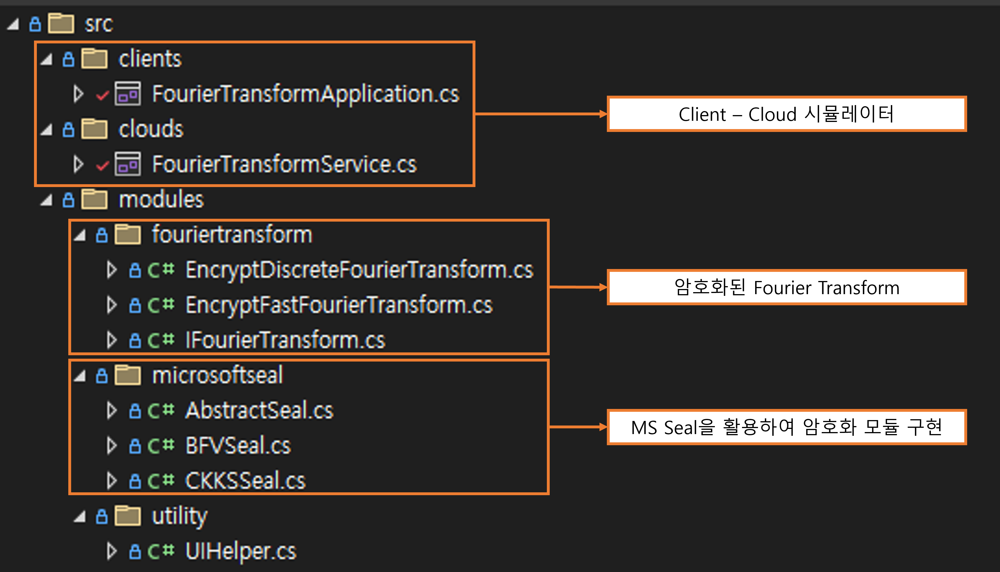

 

* Boj: [https://blog.naver.com/jqkt15](https://solved.ac/profile/97mjh1012)
* Blog: https://blog.naver.com/jqkt15
* Email: java_script@kakao.com
 

# PET-Applications-Research
 개별연구(CS Privacy Enhancing Technology 응용 사례 연구)

 
 
 
 
 

 

### 1. 클래스 다이어그램

 

### 2. FFT 실행 예시

 

### 3. DFT 실행 예시

 

### 4. 소스코드 설명

 
