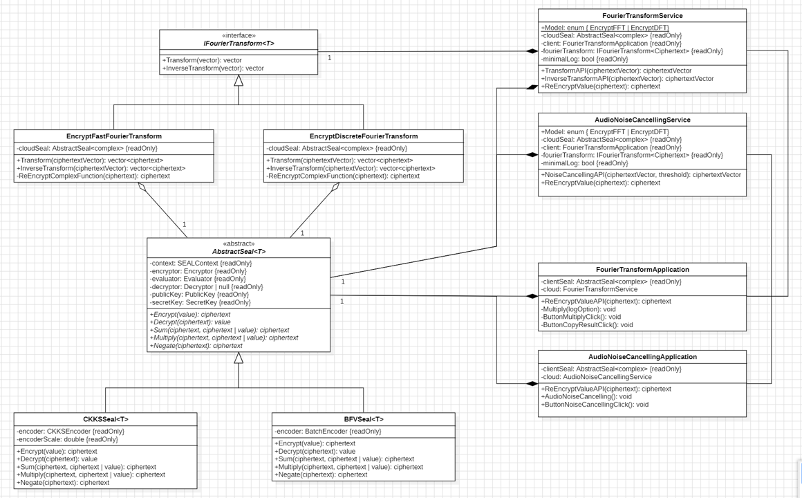
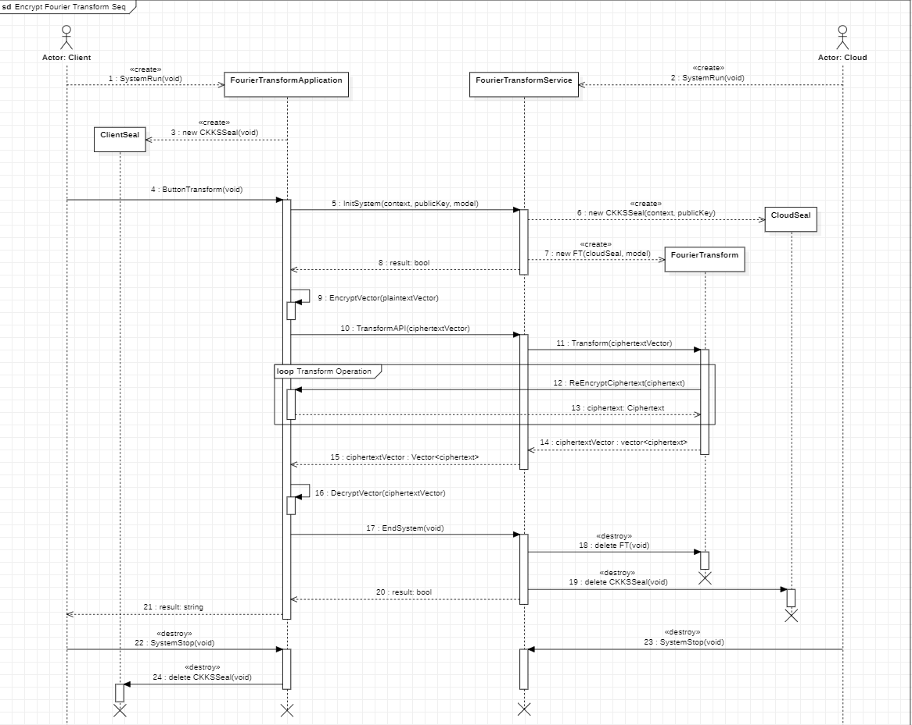
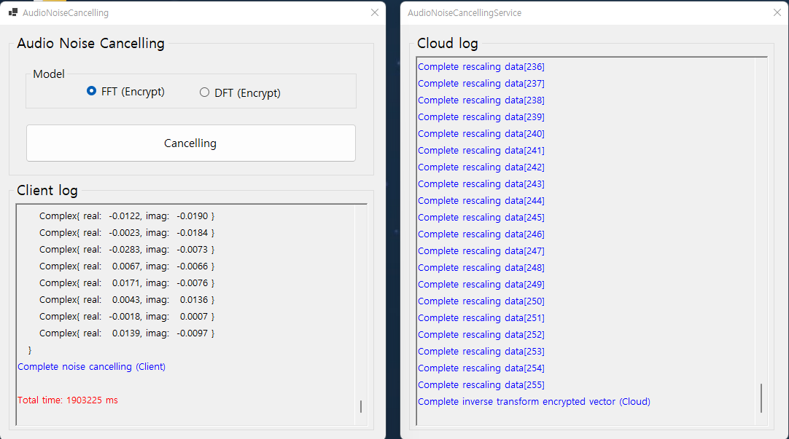
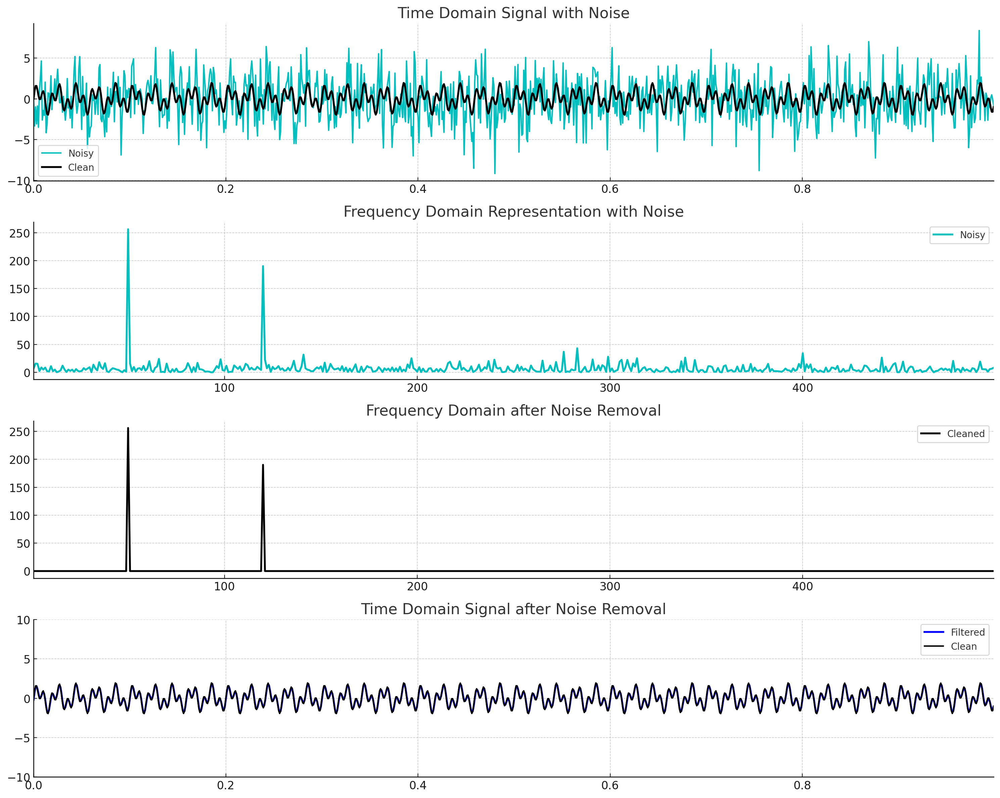
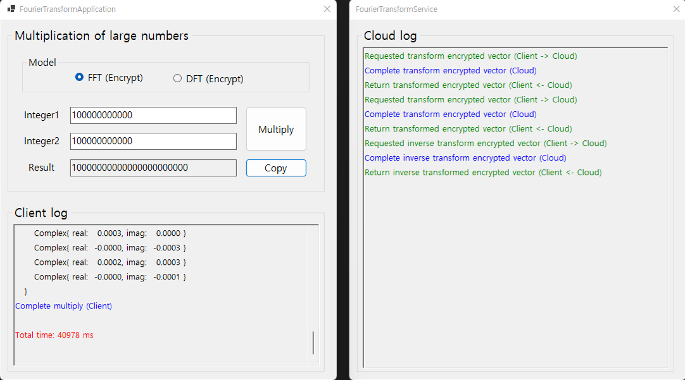
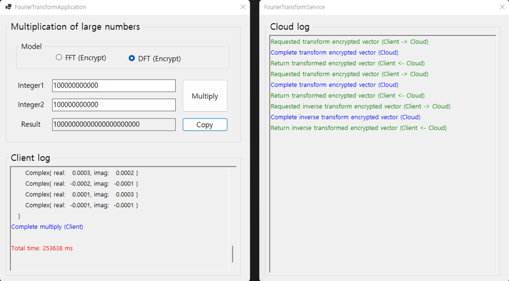
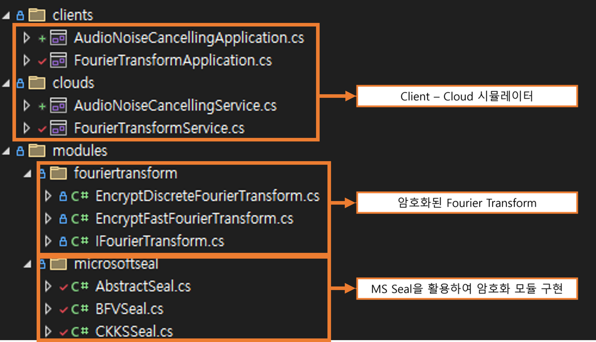

 

* Blog: https://blog.naver.com/jqkt15
* Email: java_script@kakao.com
 

# PET-Applications-Research
 개별연구1(CS Privacy Enhancing Technology 응용 사례 연구1) 
 개별연구2(CS Privacy Enhancing Technology 응용 사례 연구2) 
 

 
 

 
 
 

  
 

 

### 1. 클래스 다이어그램

 

### 2. 시퀀스 다이어그램

 

### 3. Audio Noise Cancelling (FFT) 실행 예시

 

### 4. FFT 실행 예시

 

### 5. DFT 실행 예시

 

### 6. 소스코드 설명

 
